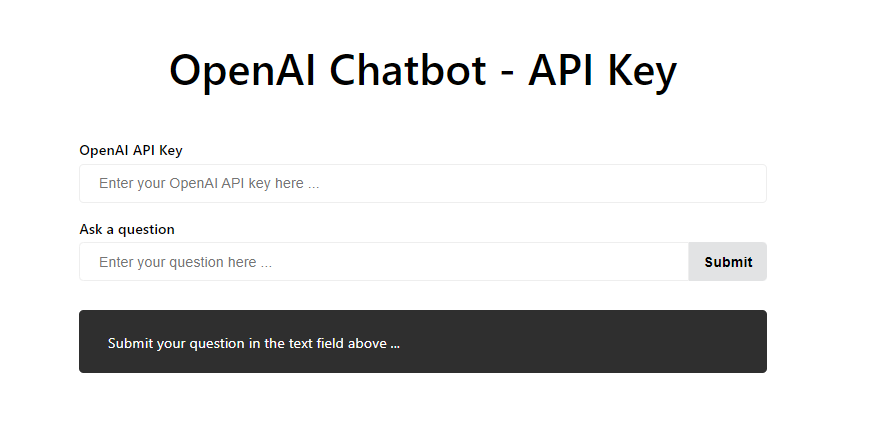

# OpenAI Chatbot with User API Key in React

This project is a chatbot that uses OpenAI's GPT-3 API to generate responses to user input. The chatbot is built using React and the server is built using Node.js and Express. The server connects to OpenAI's GPT-3 API and sends the user's input and API Key to the API to generate a response. The response is then sent back to the client and displayed in the chat window.

## How To Get Started

In the project directory:

### Install Dependencies

To install all the dependencies required to run the app run `npm install` in the project directory.

### Start the App

`npm start` runs the app in the development mode.\
Open [http://localhost:3000](http://localhost:3000) to view it in your browser.

The page will reload when you make changes.\
You may also see any lint errors in the console.

### Start the Server

`node server.js` Runs the server that connects to OpenAI's GPT-3 API.\

## Learn More

To learn more about OpenAI's GPT-3, check out the [OpenAI API documentation](https://beta.openai.com/docs/).
